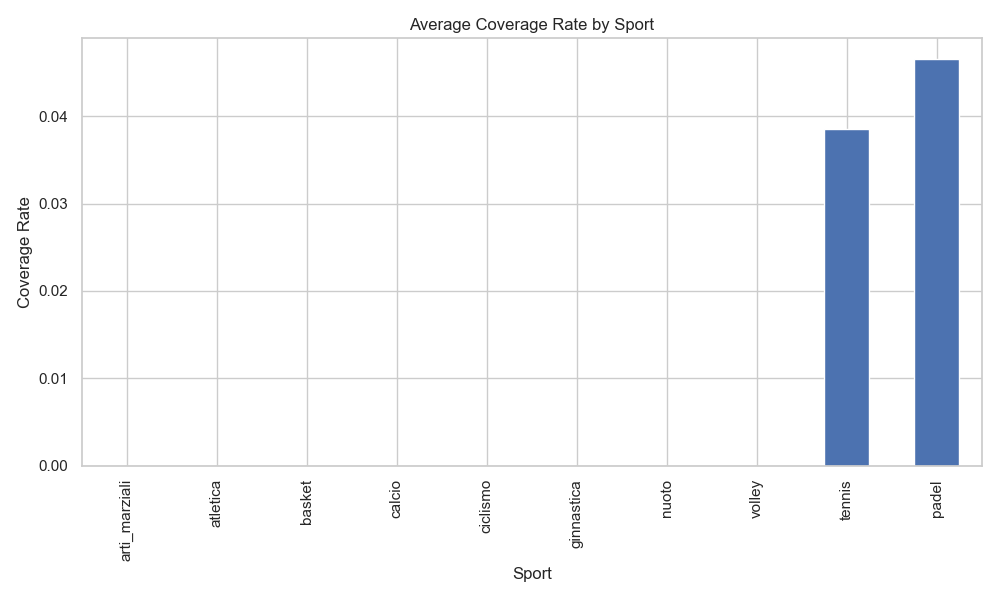
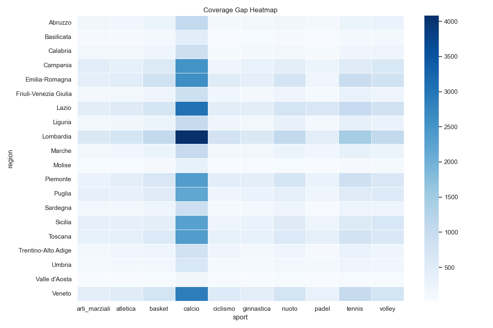

# Sports Platform Coverage Gap Analysis


## 📊 Interactive Dashboard

Explore the interactive dashboard built on the final dataset:

➡️ **[Open the Looker Studio Dashboard](https://lookerstudio.google.com/s/tDAIpFPxjls)**

The dashboard allows users to explore:

- platform coverage by region
- sport-specific adoption
- territories with the highest expansion potential

### 🏟️ Project Type
-  Data Analysis

The project investigates potential coverage gaps in a sports platform by comparing the estimated sports supply in each region with simulated platform coverage.

### 🎯 Project Goal
Identify regions and sports that are not yet served (or only partially served) by the platform,
highlighting areas with greater potential for coverage, visibility, or adoption.

### ❓ Main Business Question
Which Italian regions show the largest gap between the estimated territorial sports supply and the coverage provided by a sports platform?

### 📊 Scope (MVP)
- Main unit of analysis: **region**
- Comparison between **market supply** and **platform coverage**
- Coverage simulated on a structured dataset in **JSON/CSV format**
- **Main KPIs**:
    - coverage rate
    - coverage gap
    - sports coverage rate
    - priority score

### 🛠 Planned Stack
- Python
- Pandas
- Jupyter
- Matplotlib
- Git / GitHub

### 📦 Data Sources
The analysis combines multiple data sources to estimate territorial sports supply and platform coverage.
Possible sources include:
- Italian open data on sports clubs and facilities
- Federations or regional sports registries
- Simulated platform dataset representing registered clubs or organizations
- Manually curated datasets when public data is unavailable
- Datasets are stored following a typical data project structure:
```text
    data/
      raw/        # original datasets
      interim/    # cleaned intermediate datasets
      processed/  # final analysis-ready datasets
```

### 🗂️ Project Structure
```text
data/
  raw/
  interim/
  processed/
notebooks/
src/
reports/
docs/
```

### 📂 Folder Description
```text
data/           # contains all datasets used during the project lifecycle
notebooks/      # jupyter notebooks used for exploration, cleaning, and analysis
src/            # python scripts for reusable data processing and KPI calculation
reports/        # final charts, visualizations, and insights
docs/           # additional documentation or methodology notes
```

### 📈 Expected Outputs

The project will generate:
- Territorial **coverage maps**
- **Coverage gap ranking** by region or province
- Sport-specific coverage analysis
- A **priority score** highlighting areas where platform expansion could have the highest impact

These outputs can support **strategic decisions for sports platforms**, such as:
- identifying underserved territories
- prioritizing expansion
- improving platform adoption among sports organizations.

### 🔑 Key Findings
The analysis highlights several significant coverage gaps between the estimated market of sports clubs and the clubs currently present on the platform.

Key observations include:
- Football shows the largest coverage gap across most Italian regions.
- Northern regions generally display higher platform coverage compared to southern regions.
- Several sports such as tennis, volleyball and athletics show significant growth opportunities in medium-size regions.
- Some region–sport combinations reveal particularly low platform adoption despite a high estimated number of clubs.

These findings suggest that targeted expansion strategies could significantly increase platform adoption in underserved areas.

### 📈 Example Results
| Region | Sport | Coverage Rate |
|------|------|------|
| Lombardia | Football | 3.5% |
| Lazio | Tennis | 6.1% |
| Sicilia | Football | 4.0% |

### 🚀 Final Dataset
The pipeline generates the final analytical dataset: 
`data/processed/coverage_gap_analysis.csv`

Main fields:

- `region`
- `sport`
- `clubs_estimated`
- `platform_clubs`
- `coverage_rate`
- `coverage_gap`
- `priority_score`

This dataset summarizes the relationship between estimated market supply and platform presence, enabling further analysis and visualization.


### 📊 Visual Insights






### 🔁 Reproducibility
The full data pipeline can be executed automatically via GitHub Actions or locally.
Run locally:
```bash
python src/run_pipeline.py
```
The pipeline will generate all processed datasets in: 
`data/processed/`

## 🔗 Interactive Dashboard

An [interactive Looker Studio dashboard](https://lookerstudio.google.com/s/tDAIpFPxjls) is available to explore the coverage gap analysis.

The dashboard allows users to:
- explore coverage by region
- analyze sport-specific adoption
- identify territories with the highest expansion potential
- filter results by sport and region

## 👤 Author

Alessandro Attene
