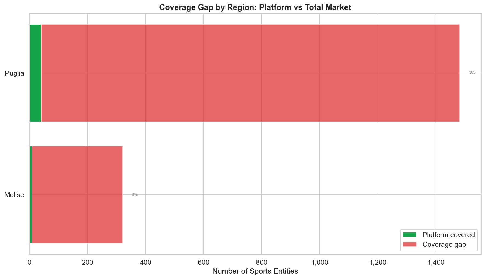
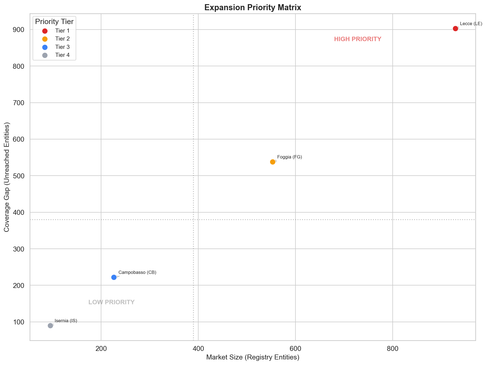
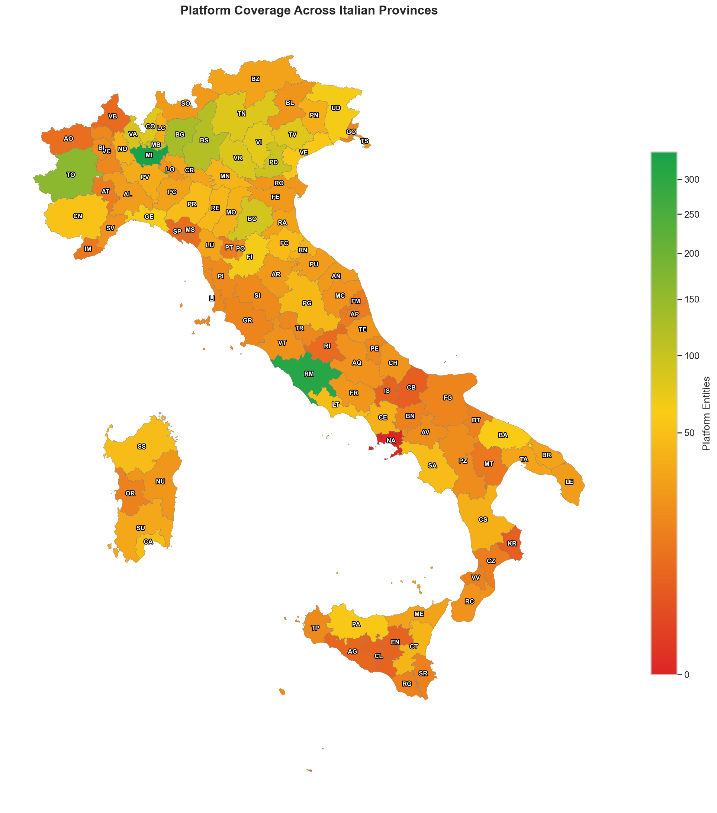
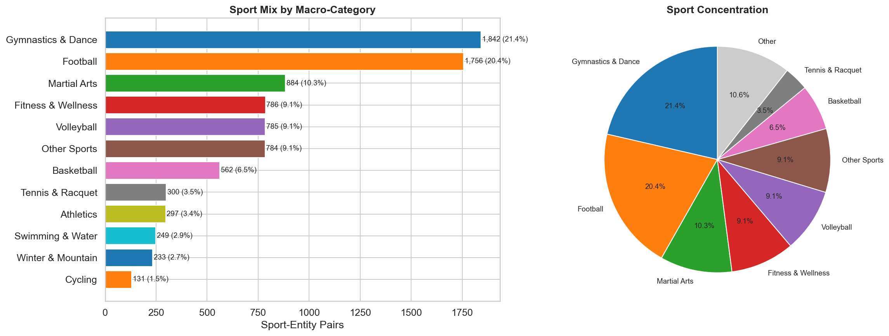

# Analisi dei Gap di Copertura delle Piattaforme Sportive

> English version: [README.md](README.md)


[](https://codecov.io/gh/aleattene/sports-platform-coverage-gap-analysis)


Progetto di **Data Analysis** end-to-end che mappa la distribuzione delle società sportive italiane
registrate in un registro sportivo ufficiale e la confronta con la copertura di una piattaforma
di gestione sportiva — identificando gap geografici e per disciplina a supporto di decisioni
di espansione basate sui dati.

---

## Domande di Business

L'analisi risponde a cinque domande chiave per una piattaforma sportiva operante in Italia:

1. **Dove dovrebbe espandersi prima la piattaforma?** Quali province mostrano il gap maggiore tra società sportive registrate e copertura della piattaforma?
2. **Quali discipline rappresentano la maggiore opportunità non sfruttata?** Qual è il mix sportivo sulla piattaforma e quali categorie sono sotto-rappresentate?
3. **Come sta crescendo la piattaforma nel tempo?** Come si presenta la traiettoria delle registrazioni?
4. **Come dovrebbe essere strutturata una strategia di espansione per fasi?** Come si possono prioritizzare le province in base alla dimensione del mercato e al gap attuale?
5. **Qual è il mercato totale indirizzabile non ancora raggiunto?** Quanto è ampio il gap di copertura in termini assoluti?

---

## Principali Risultati

Nel dataset attuale, la piattaforma è presente in tutte le 107 province italiane,
ma la profondità di copertura è molto disomogenea.
Dove i dati del registro sono disponibili, il gap tra le società totali registrate
e la presenza sulla piattaforma è sostanziale — il mercato è in larga parte non raggiunto.

### Gap di Copertura per Regione



### Matrice di Priorità Espansione



### Mappa Geografica di Copertura



### Distribuzione per Disciplina Sportiva



> Per l'analisi completa con tutte le visualizzazioni, consulta il [Report Esecutivo](reports/REPORT.md)
> e il [Notebook EDA](notebooks/01_coverage_gap_analysis.ipynb).

---

## Perimetro dell'Analisi

- **Unità di analisi:** provincia (107 province italiane)
- **Dimensioni:** geografica (regione/provincia), categoria sportiva (174 discipline, 12 macro-categorie), temporale (anno di registrazione)
- **KPI principali:**

| KPI | Formula | Interpretazione |
|-----|---------|-----------------|
| Tasso di Copertura | `platform_entities / entities_total` | 0 = nessuna copertura, 1 = copertura totale |
| Gap di Copertura | `entities_total - platform_entities` | Numero assoluto di entità non raggiunte |
| Punteggio Priorità | `0.6 × gap_score + 0.4 × density_score` | Priorità composita di espansione (0–1) |

*`platform_entities` e `entities_total` corrispondono ai nomi di colonna nei CSV del progetto; `gap_score` e `density_score` sono punteggi derivati calcolati nell'analisi.*

---

## Output Attesi

| Output | Descrizione |
|--------|-------------|
| Ranking gap di copertura | Per regione e provincia, con tasso di copertura e gap assoluto |
| Ranking priorità espansione | Province classificate e suddivise per tier in base a dimensione mercato e gap |
| Analisi opportunità per disciplina | Distribuzione per macro-categoria, indice di diversità sportiva, segmenti sotto-serviti |
| Tendenza crescita temporale | Traiettoria registrazioni anno su anno con vista cumulativa |
| Visualizzazione geografica | Mappa coropletica della copertura della piattaforma nelle province italiane |
| Dashboard interattiva | [Looker Studio Dashboard](https://lookerstudio.google.com/s/tDAIpFPxjls) |

---

## Fonti dei Dati

L'analisi combina due fonti di dati pubbliche:

| Fonte | Descrizione | Granularità |
|-------|-------------|-------------|
| **Registro** | Registro sportivo ufficiale — totale società registrate | Provincia |
| **Piattaforma** | Piattaforma di gestione sportiva — società presenti sulla piattaforma | Provincia + Disciplina + Anno |

> **Privacy by design:** i dati grezzi della piattaforma vengono sanitizzati al momento della raccolta.
> Nessun dato personale (PII) viene analizzato o salvato su disco.

---

## Struttura del Progetto

```text
project_root/
├── run_pipeline.py                  # Orchestratore pipeline
├── requirements.txt
├── src/
│   ├── config.py                    # Configurazione centralizzata (variabili d'ambiente)
│   ├── utils/                       # Utility condivise (HTTP, I/O, logging)
│   └── data_collection/
│       ├── sport_registries/        # Pipeline registro (Playwright, 4 step)
│       └── sport_platforms/         # Pipeline piattaforma (REST API, 2 step)
├── data/
│   ├── sources/
│   │   ├── sport_registries/        # Dati grezzi + processati del registro
│   │   └── sport_platforms/         # Dati grezzi + processati della piattaforma
│   ├── analysis/                    # Output notebook (CSV)
│   └── quality/                     # Sommari esecuzione pipeline
├── data_sample/                     # Dati di esempio e schemi (versionati)
├── notebooks/
│   └── 01_coverage_gap_analysis.ipynb   # Notebook EDA
└── reports/
    ├── REPORT.md                    # Report esecutivo
    └── figures/                     # Grafici generati dal notebook
```

---

## Stack Tecnologico

| Componente | Tecnologia |
|------------|------------|
| Linguaggio | Python 3.13 |
| Manipolazione dati | Pandas, NumPy |
| Visualizzazione | Matplotlib, Seaborn |
| Notebook | Jupyter |
| Raccolta dati | Playwright (registro), client HTTP con retry/backoff (piattaforma) |
| Visualizzazione geografica | GeoPandas |
| Dashboard | Looker Studio |

---

## Riproducibilità

```bash
# 1. Installa le dipendenze
pip install -r requirements.txt
playwright install chromium

# 1b. Installa i pre-commit hook (rimuove gli output del notebook prima di ogni commit)
pre-commit install

# 2. Copia i confini geografici in data/
cp -r data_sample/geo data/geo

# 3. Configura l'ambiente (copia e modifica secondo necessità)
cp .env.example .env
# Non sono richiesti valori per eseguire la pipeline di default (solo dati locali).
# Imposta SOURCE_URL e le variabili del registro solo quando FETCH_REGISTRY_DATA=true.
# Imposta PLATFORM_BASE_URL e le variabili della piattaforma solo quando FETCH_PLATFORM_DATA=true.

# 4. Popola data/ recuperando dai sorgenti configurati
# 4a. Recupera dati dalla piattaforma API
FETCH_PLATFORM_DATA=true python -m run_pipeline

# 4b. Recupera dati dal registro
FETCH_REGISTRY_DATA=true python -m run_pipeline

# 5. Esegui la pipeline (processa i dati locali esistenti — nessuna chiamata remota)
python -m run_pipeline

# Esegui il notebook EDA
jupyter notebook notebooks/01_coverage_gap_analysis.ipynb
```

> Di default la pipeline **non effettua alcuna chiamata remota** — elabora i dati grezzi esistenti.
> Imposta le variabili d'ambiente sopra indicate per avviare la raccolta di dati freschi.

---

## Report

Per metodologia dettagliata, risultati e tutte le visualizzazioni:

- [Report Esecutivo](reports/REPORT.md) — risultati, raccomandazioni strategiche e tutti i grafici
- [Notebook EDA](notebooks/01_coverage_gap_analysis.ipynb) — analisi esplorativa completa con codice

---

## Autore

Alessandro Attene
