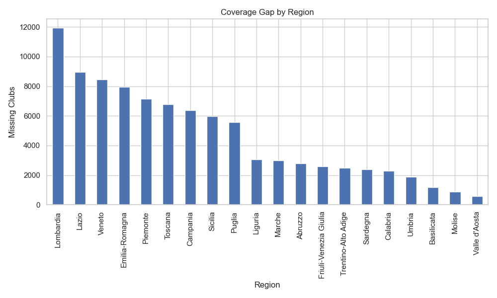

# Coverage Gap Analysis — Report

## Methodology

This analysis compares two data sources to identify geographic coverage gaps in a sports platform operating in Italy:

- **Registry data** — The number of sports entities (clubs/associations) from an official sports registry, broken down by province (~107 provinces).
- **Platform data** — The number of sports entities currently present on the platform, broken down by province.

The two datasets are merged on `province_abbr` (left join on registry data). Provinces not covered by the platform receive `platform_entities = 0`.

### Key KPIs

| KPI | Formula | Description |
|-----|---------|-------------|
| **Coverage Ratio** | `platform_entities / entities_total` | Share of registered entities covered by the platform |
| **Coverage Gap** | `entities_total - platform_entities` | Absolute number of entities not yet on the platform |

---

## Results

### Coverage Gap by Region

Regions with the largest absolute gap between registered entities and platform presence.

### Coverage Ratio Heatmap

Province-level view of platform penetration. Most provinces show zero coverage, with only regional capitals currently served.

### Interactive Dashboard

Explore the data interactively on Looker Studio:

[Open the Looker Studio Dashboard](https://lookerstudio.google.com/s/tDAIpFPxjls)

> A Google account may be required to view the dashboard.

---

## Key Findings

1. Most provinces have **zero platform coverage**, indicating significant expansion potential across Italy.
2. The largest coverage gaps are concentrated in the most populated regions (Lombardia, Lazio, Veneto, Emilia-Romagna).
3. The platform currently covers only **one province per region** (the regional capital), leaving all other provinces unserved.
4. Even in covered provinces, the **coverage ratio remains low**, suggesting room for deeper penetration alongside geographic expansion.

---

## Conclusions

The analysis highlights a clear opportunity for geographic expansion. The platform currently operates in a fraction of Italian provinces, and the gap is largest in regions with the highest concentration of sports entities. A prioritized rollout strategy targeting high-gap provinces could significantly increase platform adoption.

---

## Data Sources

| Source | Path |
|--------|------|
| Registry | `data/sources/sport_registries/<registry_name>/processed/registry_entity_counts_by_province.csv` |
| Platform | `data/sources/sport_platforms/<platform_name>/processed/platform_entity_counts_by_province.csv` |
| Analysis output | `data/analysis/coverage_gap_by_province.csv` |

## Notebook

The full exploratory analysis is available in [`notebooks/03_coverage_gap_analysis.ipynb`](../notebooks/03_coverage_gap_analysis.ipynb).
