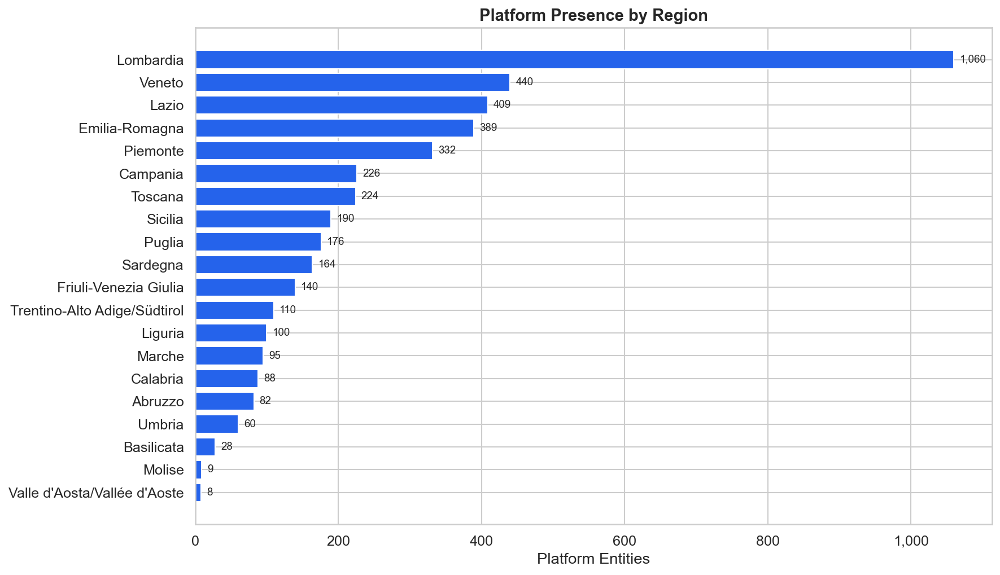
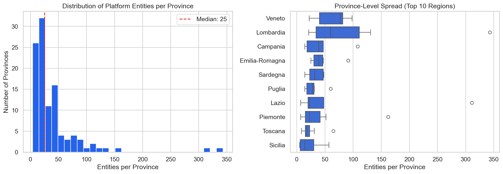
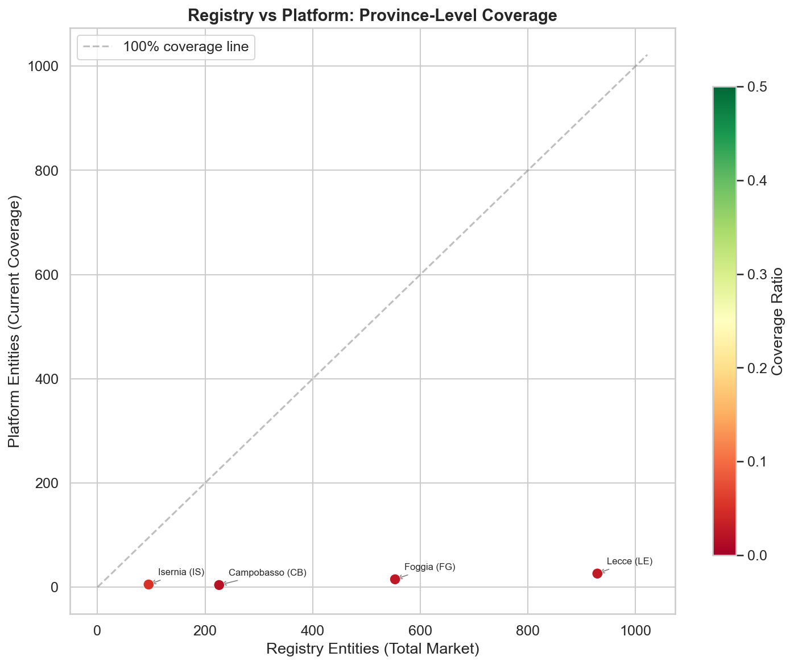
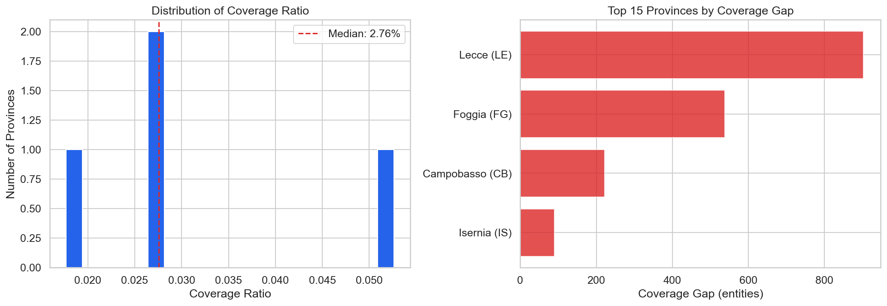
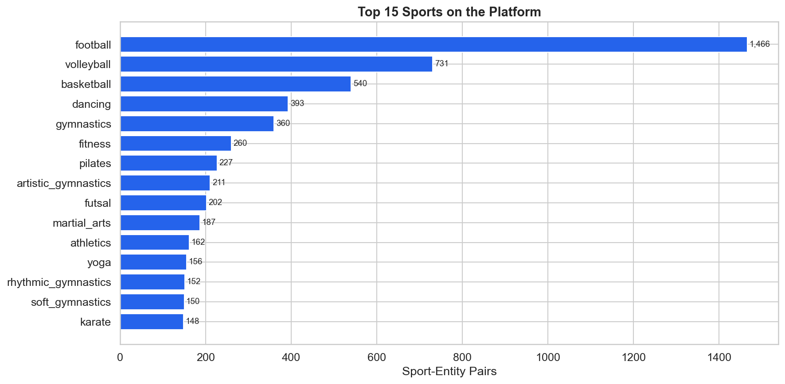
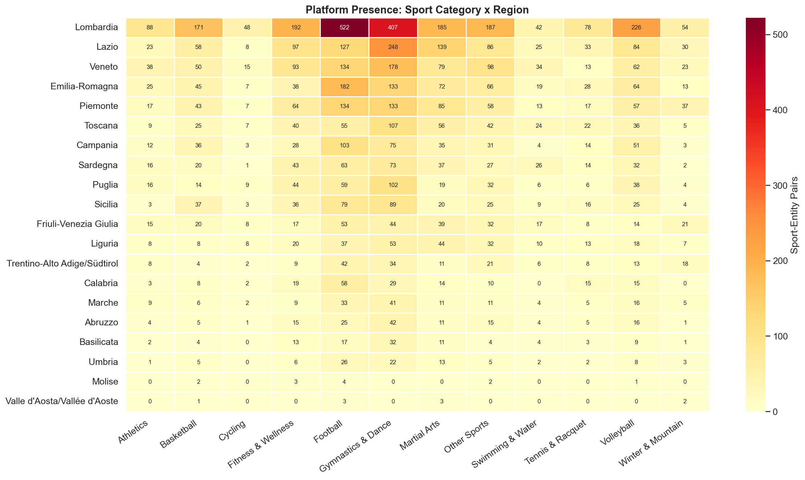
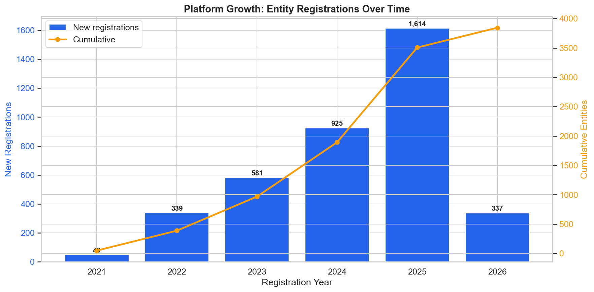
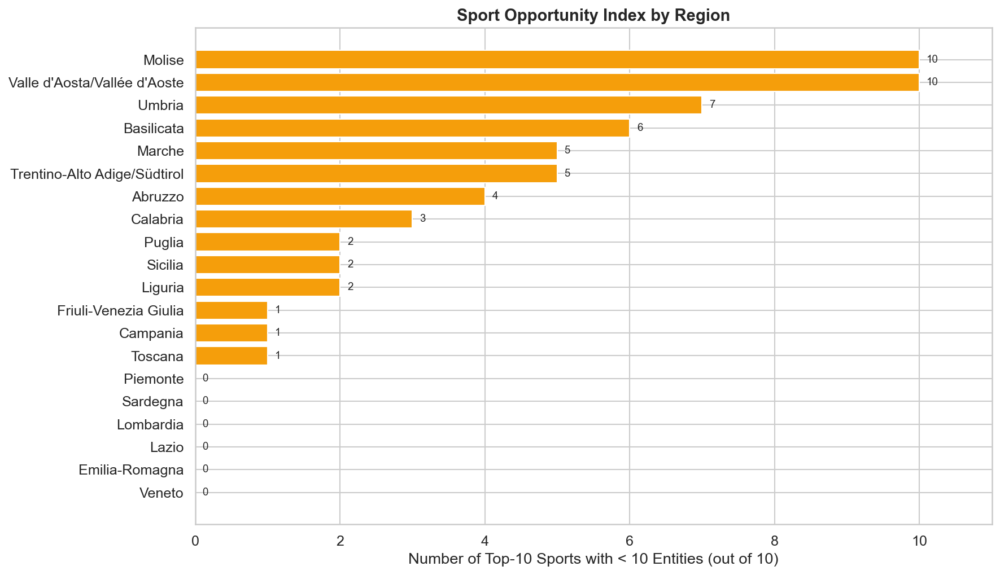

# Coverage Gap Analysis — Executive Report

## Executive Summary

- **Total addressable market:** The official sports registry lists thousands of registered entities distributed across all 107 Italian provinces.
- **Platform coverage:** In the current dataset, the platform is present across all 107 provinces, but coverage depth is highly uneven — a handful of provinces concentrate the vast majority of activity.
- **Coverage gap:** Where registry data is available, the platform has captured only a small fraction of the total addressable market. The largest absolute gaps are concentrated in the most populated provinces (Lombardia, Lazio, Veneto, Emilia-Romagna).
- **Recommended action:** A phased expansion strategy targeting Tier-1 provinces (largest market + largest gap) represents the highest-impact growth path.

---

## 1. Context and Objective

This analysis answers five key business questions for a sports management platform operating in Italy:

1. **Where should the platform expand first?** Which provinces show the largest gap between registered sports entities and platform coverage?
2. **Which sports represent the biggest untapped opportunity?** What is the sport mix on the platform, and which categories are under-represented?
3. **How is the platform growing over time?** What does the registration trajectory look like?
4. **What should a phased expansion strategy look like?** How can provinces be prioritized based on market size and current gap?
5. **What is the total addressable market not yet reached?** How large is the coverage gap in absolute terms?

### Data Sources

| Source | Description | Granularity |
|--------|-------------|-------------|
| **Registry** | Official sports registry — total registered entities by province | Province (~107) |
| **Platform** | Sports management platform — entities currently on the platform | Province + Sport + Year |

> **Privacy note:** Platform raw data has been sanitized at collection time. Only `sport`, `registration_year`, `province_abbr`, and `region_code` are retained. No personal data (names, addresses, coordinates) is stored.

### Key KPIs

| KPI | Formula | Interpretation |
|-----|---------|----------------|
| **Coverage Ratio** | `platform_entities / entities_total` | 0 = no coverage, 1 = full coverage |
| **Coverage Gap** | `entities_total - platform_entities` | Absolute number of unreached entities |

---

## 2. Platform Geographic Distribution

Before analyzing the coverage gap, it is important to understand where the platform currently operates.

The platform is present across all Italian regions, but concentration is highly uneven. Lombardia, Lazio, and Veneto lead by total entity count. The distribution within each region is further skewed toward the regional capital province.

The histogram confirms a long-tail distribution: most provinces have relatively few entities, while a small number of provinces account for a disproportionate share.

### Geographic Coverage Map

The choropleth map provides an immediate geographic reading of platform coverage across all Italian provinces. Green shades indicate higher entity counts, yellow intermediate, and red lower counts. The visual confirms that coverage is concentrated in northern and central Italy, with southern regions and islands showing comparatively lower presence — reinforcing the priority framework discussed in Section 6.

---

## 3. Coverage Gap Analysis

Comparing the official registry (total addressable market) with platform presence reveals the size of the opportunity.

### Coverage Gap by Region

The stacked bar chart shows each region's total market (green = covered by platform, red = gap). The coverage ratio label on the right of each bar quantifies the platform's current penetration.

### Registry vs Platform: Province-Level View

The scatter plot places each province on a market-size vs platform-coverage axis. The diagonal dashed line represents 100% coverage. The clustering of points near the x-axis confirms that most provinces sit far below full coverage — the market is largely untapped.

### Coverage Ratio Distribution

The histogram shows that the majority of provinces have a very low coverage ratio. The right panel highlights the top 15 provinces by absolute gap — these are the highest-priority targets for expansion.

---

## 4. Sport-Level Analysis

The platform covers 174 individual sports, grouped into 12 macro-categories for analysis.

### Top Sports on the Platform

Football is the dominant sport, followed by Volleyball and Basketball. These three categories alone account for the majority of sport-entity pairs on the platform.

### Sport Mix and Concentration

The top 3 macro-categories concentrate over half of all sport-entity pairs. This creates both a strength (clear beachhead in ball sports) and a strategic risk (limited diversification). Categories like Athletics, Winter & Mountain, and Fitness & Wellness represent under-represented segments with expansion potential.

### Sport x Region Heatmap

The heatmap reveals the depth of sport coverage by region. Lombardia and Lazio lead across almost every category. Several regions show significant gaps in specific sport categories, representing targeted growth opportunities.

---

## 5. Growth Trajectory

Registration data shows a sustained growth trajectory over recent years, indicating positive market momentum and increasing platform adoption. The cumulative line confirms consistent year-over-year growth.

> **Note:** A portion of entities have no registration year recorded and are excluded from this chart.

---

## 6. Expansion Opportunity

### Priority Framework

To identify the highest-value provinces for expansion, a composite scoring model was built:

| Factor | Weight | Rationale |
|--------|--------|-----------|
| **Gap Score** | 60% | Larger gap = more unreached entities |
| **Density Score** | 40% | Larger market = higher absolute opportunity |

Provinces are scored and assigned to four priority tiers (Tier 1 = highest priority).

### Priority Matrix

The top-right quadrant (large market + large gap) represents the most impactful expansion targets. Tier-1 provinces are annotated — these are the highest-value destinations for geographic expansion.

### Sport Opportunity by Region

For each region, the chart shows how many of the top-10 sport categories have fewer than 10 entities — a proxy for under-served sport segments. Regions with high scores have strong potential for sport-level deepening.

### Recommended Expansion Strategy

| Phase | Focus | Criteria |
|-------|-------|----------|
| **Phase 1** | Geographic expansion | Tier-1 provinces — largest market + largest gap |
| **Phase 2** | Sport deepening | Add under-represented sport categories in existing regions |
| **Phase 3** | Long-tail expansion | Tier-2 provinces — medium market, moderate gap |

---

## 7. Conclusions

1. **Market sizing:** In the current dataset, the platform is present across all provinces covered in this snapshot (107 in the current extract), but coverage depth varies enormously. A handful of provinces concentrate most of the activity.
2. **Coverage gap:** The platform has captured only a fraction of the total addressable market. The gap is largest in the most populated provinces.
3. **Sport concentration:** Football dominates the platform's sport mix. The top 3 macro-categories account for over half of all sport-entity pairs — a clear beachhead, but also a concentration risk.
4. **Growth trajectory:** Registration data shows sustained growth, indicating positive market momentum.
5. **Expansion opportunity:** The priority framework identifies high-value provinces where large markets intersect with large gaps. A phased expansion strategy starting from Tier-1 provinces represents the highest-impact path to growth.

---

## 8. Interactive Dashboard

Explore the data interactively on Looker Studio:

[Open the Looker Studio Dashboard](https://lookerstudio.google.com/s/tDAIpFPxjls)

> A Google account may be required to view the dashboard.

---

## 9. Data Sources and Methodology

| Source | Path |
|--------|------|
| Registry | `data/sources/sport_registries/<registry_name>/processed/registry_entity_counts_by_province.csv` |
| Platform | `data/sources/sport_platforms/<platform_name>/processed/platform_entity_counts_by_province.csv` |
| Coverage gap output | `data/analysis/coverage_gap_by_province.csv` |
| Expansion priority output | `data/analysis/expansion_priority_by_province.csv` |
| Sport aggregation output | `data/analysis/platform_sport_by_region.csv` |
| Geographic boundaries | `data/geo/provinces.geojson`, `data/geo/regions.geojson` — run `mkdir -p data/geo && cp data_sample/geo/. data/geo/` to populate |

The full exploratory analysis is available in [`notebooks/01_coverage_gap_analysis.ipynb`](../notebooks/01_coverage_gap_analysis.ipynb).

> **Registry data note:** If the registry pipeline was run in DEV_MODE, only a subset of provinces is available. Run `FETCH_REGISTRY_DATA=true python -m run_pipeline` for the full 107-province dataset. Platform-only analyses (sport distribution, temporal trend, geographic distribution) are unaffected by this limitation.

---

## Appendix: Analysis Outputs

| File | Description |
|------|-------------|
| `coverage_gap_by_province.csv` | Registry + platform merged at province level, with gap and ratio |
| `expansion_priority_by_province.csv` | Top provinces ranked by priority score (gap + market size) |
| `platform_sport_by_region.csv` | Sport-entity pairs aggregated by region and macro-category |
